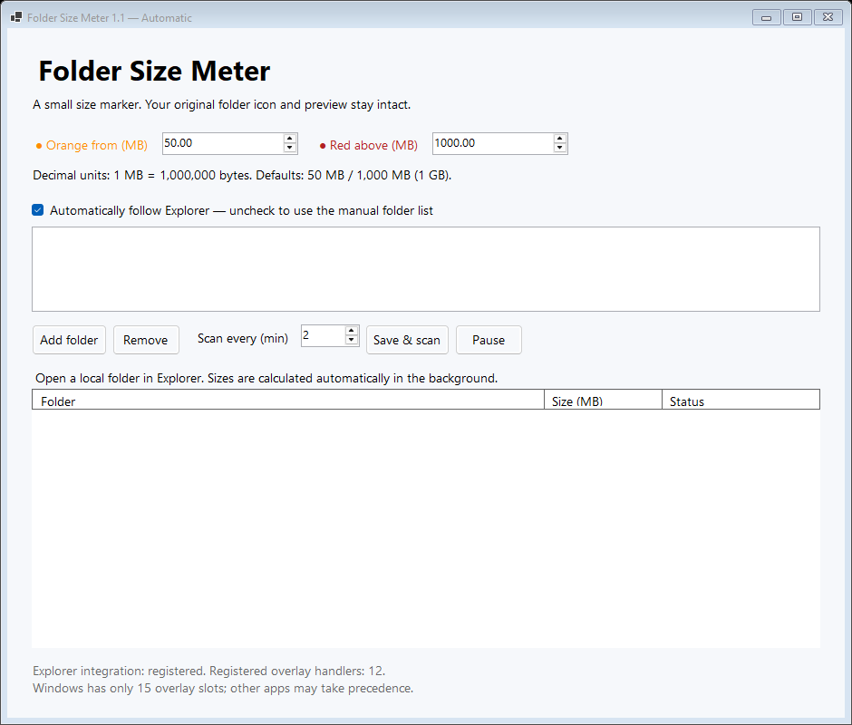

# Juicy Folder Meter

A free Windows 11 utility that shows folder-size status without replacing normal folder icons. The tray application calculates folder sizes and a small native Explorer shell extension can display orange/red status markers where Windows has an available icon-overlay slot.



## What it does

- Calculates recursive sizes for local folders.
- Uses configurable orange/red thresholds.
- Can follow folders exposed by open Explorer windows automatically.
- Keeps filesystem scanning out of Explorer; the Explorer extension only reads a bounded shared-memory cache.
- Does not disable, rename, or reorder other applications' overlay handlers.
- No ads, accounts, analytics, telemetry, or cloud service.

Windows has a small system-wide limit on icon-overlay handlers, so another installed application can prevent the visual marker from appearing even when Juicy Folder Meter itself is working. The size table in the tray application is independent of that Windows limitation.

## Requirements

- Windows 11 x64
- For building: .NET 8 SDK, Visual Studio C++ Build Tools with Windows SDK
- WiX Toolset 6 is installed automatically by the Store MSI build script when needed

The Store build publishes the .NET application self-contained, so end users do not need to install the .NET Desktop Runtime separately.

## Build

Run:

```powershell
./BUILD-STORE-MSI.ps1 -Version 1.1.0
```

or double-click `BUILD-STORE-MSI.cmd` on a configured Windows development PC.

The unsigned MSI is created under `dist/`. Public Store releases are intended to be signed through SignPath after an approved open-source signing setup.

## Architecture

The UI/scanner is C# / .NET 8 WinForms. The Explorer overlay component is a native x64 C++ COM DLL implementing `IShellIconOverlayIdentifier`. Communication is through a session-local shared-memory cache. See [technical notes](docs/TECHNICAL_NOTES.md) for implementation details and limitations.

## Privacy

See [PRIVACY.md](PRIVACY.md).

## Code signing policy

See [CODE_SIGNING_POLICY.md](CODE_SIGNING_POLICY.md).

Free code signing provided by SignPath.io, certificate by SignPath Foundation, **if and after the project is accepted by SignPath Foundation**.

## License

MIT License. See [LICENSE](LICENSE).
